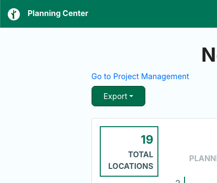

# Flock Planner Exporter

This is a simple Chrome extension to restore export functionality to the Flock Planner tool.

For some reason, Flock has removed the ability to export plans from the Flock Planner tool. This extension adds a new **Export** button to the Flock Planner tool that allows you to export the current plan to a CSV file.

## Installation

1. Clone this repository
2. Open Chrome and navigate to `chrome://extensions/`
3. Enable Developer Mode
4. Click "Load unpacked" and select the directory where you cloned this repository

## Usage

This extension will activate on the Flock Planner tool. When you are on the Flock Planner tool, you will see a new **Export** button in the top-left corner of the screen. Click this button to export the current plan to a CSV file.
